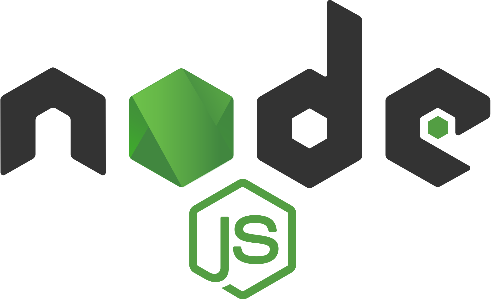

# 💻`Hello, World!`💻

Meu nome é Aluísio, sou aspirante a Dev Full-stack! Atualmente tenho foco no Front-end, usando as seguintes tecnologias: __`Javascript`__, __`Typescript`__, __`Nodejs`__, __`Reactjs`__ e __`React Native`__!

    
        
    
    
        
    
    
        
    
    
        
    
    
        
    

    
        
    
    
        
    

<h3>Contato</h3>

  
  
   

<a href="https://iconscout.com/icons/javascript" target="_blank">Javascript Icon</a> by <a href="https://iconscout.com/contributors/jagathish">Jagathish Saravanan</a> on <a href="https://iconscout.com">IconScout</a>

<a href="https://iconscout.com/icons/typescript" target="_blank">Typescript Icon</a> by <a href="https://iconscout.com/contributors/icon-mafia">Icon Mafia</a> on <a href="https://iconscout.com">IconScout</a>

<a href="https://iconscout.com/icons/nodejs" target="_blank">Nodejs Icon</a> by <a href="https://iconscout.com/contributors/icon-mafia" target="_blank">Icon Mafia</a>

Gmail icon made by <a href="https://www.flaticon.com/authors/pixel-perfect" title="Pixel perfect">Pixel perfect</a> from <a href="https://www.flaticon.com/" title="Flaticon">www.flaticon.com</a>

LinkedIn icon made by<a href="https://www.flaticon.com/authors/riajulislam" title="riajulislam">riajulislam</a> from <a href="https://www.flaticon.com/" title="Flaticon">www.flaticon.com</a>
 

<a href="https://iconscout.com/icons/instagram" target="_blank">Instagram Icon</a> by <a href="https://iconscout.com/contributors/stonehub">Stone Hub</a> on <a href="https://iconscout.com">IconScout</a>
